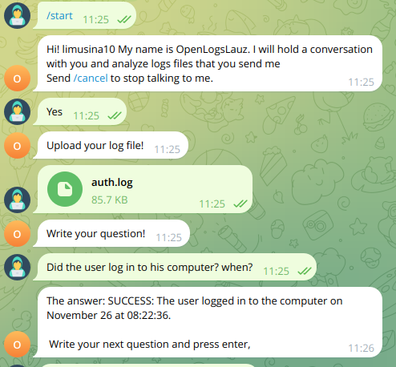

# OpenLogsLauz
Unleash the power of AI and let it cook (foundue, if possible) to brew the answers to all of your questions.




This is a project made in LauzHack 2023 at EPFL, Lausane, Switzerland

## Inspiration
We realized that most of our daily programming issues can be identified by looking carefully at the logs. But what a better way to automatize this boring and tedious task. 

## What it does
We have built a Telegram chatbot that lets you upload the log file you want to analyze and what would you like to know about it. It will return the answer to your question. A good example is: 

\*Uploads the log file\*

IN: ` Did the user 'jonny' remove any program in his computer?`

OUT: ` Yes! The user jonny deleted the 'google-chrome-stable' on Nov 27 at 23:57:23`


## How we built
We splited the project into two main parts: the gptCore stuff, and the Telegram API, both programmed in Python3. 

## How to run

Install Python3, git and venv.

If you are using a Debian/ Debian-based OSs you can:
```sh
su root
apt install git
apt install Python3
apt install python-dotenv
```

Get a telegram bot API key and GPT API key. 
    You can follow these instructions to create a Telegram Bot: https://core.telegram.org/bots#how-do-i-create-a-bot.


Clone our repo by:

```sh
git clone https://github.com/EncryptEx/LauzHack23
```
Create a virtualenviroment in python by:
```sh
python3 -m venv env
```
Then, enter it and install the requirements

```sh
source env/bin/activate
pip install -r requirements.txt
```
Create a .venv file using the template in the .env.example file (or just delete the ".example" in the file) and add you API keyes.

And finally, just run the main file!

```sh
python3 chatbot.py
```

Start chatting with the bot at [Telegram](https://t.me/openlogslauz_bot).

> PROTIP: Use our generated authentication file (from /var/log/auth.log)

> You can generate system log files at [see Other System Log Siles](###Other-System-Log-Files) (bottom of readme)


Congrats!! The bot is ready to use.

## Challenges we ran into

We used LLMs (ChatGPT) to cerate a answer taking into account the log file we needed to send a request with a lot of tokens. We started by using chatgpt3.5-turbo with 4k tokens. As a quick fix, we upgraded the version to chatgpt4-turbo-preview with aproximentely 128k tokens of context, meaning that we could upload all the file without choping it in pices. This worked quite well with the downside of being quite expensive (1€/request). Because of that, we had to dongrade the version to chatgpt3.5-16k that is a bit slower but has 4 times the amount context tokens (16k context tokens). With that, we couldn't treat large log files so we opted to chop the files in pices and paralelize the ChatGPT API requests, losing some context but being sustantialy cheaper.

## Accomplishments that we made
We learned how to implement and use LLMs, as well as integrating them to Python scripts, and consequently, the Telegram APIs. 
We also discovered the world of LLM models, since we thought there wouldn't exist that much. We also learned by the economical way the price of GPT4-turbo xd

## What we learned
We learned quite a lot about Telegram bots and Chat GPT API. We learned about context in LLMs and system-logs workflow analisys.

## What's next
We'd like to use a all-in-one model that can read a single file and ask questions in the same context/conversation, because we ran out of context window tokens because of the log file size. If you want to know how we managed to solve this issue: we opted to chop and split paraelly the data into multiple GPT3.5-turbo conversations.


### Other System Log Siles
| File Path                                  | Description                                           | Use Cases                                                     |
|--------------------------------------------|-------------------------------------------------------|---------------------------------------------------------------|
| `/var/log/syslog`                          | Primary system log file.                              | General system issues, service logs.                          |
| `/var/log/dmesg`                           | Kernel ring buffer messages.                          | Hardware, driver issues.                                      |
| `/var/log/auth.log`                        | Authentication logs.                                  | Security auditing, login issues.                              |
| `/var/log/kern.log`                        | Kernel logs.                                          | Linux kernel issues.                                          |
| `/var/log/boot.log`                        | System boot process logs.                             | Boot-related problems.                                        |
| `/var/log/dpkg.log`                        | Package installation and removal activity.            | Package management activities.                                |
| `/var/log/apache2/access.log`              | Apache server access logs.                            | Web server access information (if Apache is used).            |
| `/var/log/apache2/error.log`               | Apache server error logs.                             | Web server error information (if Apache is used).             |
| `/var/log/mysql.log`                       | MySQL general log.                                    | MySQL database operations (if MySQL is used).                 |
| `/var/log/mysql.err`                       | MySQL error log.                                      | MySQL database errors (if MySQL is used).                     |
| `/var/log/mail.log`                        | Mail server logs.                                     | Mail server operations.                                       |
| `/var/log/unattended-upgrades.log`         | Automatic software updates logs.                      | Unattended software updates.                                  |
| `/var/log/Xorg.0.log`                      | X.Org server logs.                                    | Graphical display issues.                                     |
| `/var/log/ufw.log`                         | Uncomplicated Firewall (UFW) logs.                    | Firewall operations and issues.                               |
| `/var/log/alternatives.log`                | Update-alternatives mechanism logs.                   | Default command changes.                                      |
| `/var/log/apt/history.log`                 | APT command history.                                  | Software package management history.                          |
| `/var/log/apt/term.log`                    | Terminal output of APT operations.                    | Detailed view of APT operations.                              |
| `/var/log/cron.log`                        | Cron job scheduler logs.                              | Scheduled task operations.                                    |
| `/var/log/user.log`                        | User-level application logs.                          | Application-specific issues.                                  |
| `/var/log/debug`                           | Debug messages from system and applications.          | In-depth troubleshooting.                                     |
| `/var/log/faillog`                         | Failed login attempts log.                            | Security analysis for unauthorized access attempts.           |
| `/var/log/lastlog`                         | Record of last logins of all users.                    | User activity tracking.                                       |
| `/var/log/wtmp` and `/var/log/btmp`        | Login/logout history and bad login attempts.          | User login history and unauthorized login attempts.           |
| `/var/log/journal/`                        | Systemd's journal files.                              | Comprehensive system logging (if systemd is used).            |
| `/var/log/lightdm/lightdm.log`             | LightDM display manager logs.                         | Desktop display manager operations (if LightDM is used).      |
| `/var/log/sysstat/`                        | Sysstat package logs for performance monitoring.      | System performance analysis (if sysstat is used).             |
| `/var/log/anaconda.log`                    | Anaconda installer logs.                              | Installation process details (if Anaconda is used).           |
| `~/.bash_history`                          | User-specific command history in Bash shell.          | Review and audit of user-executed commands in Bash.           |


## Aknowledgements
Thanks for LauzHack for hosting the event, EPFL for the venue and OpenSystems for bringing us an amazing challenge